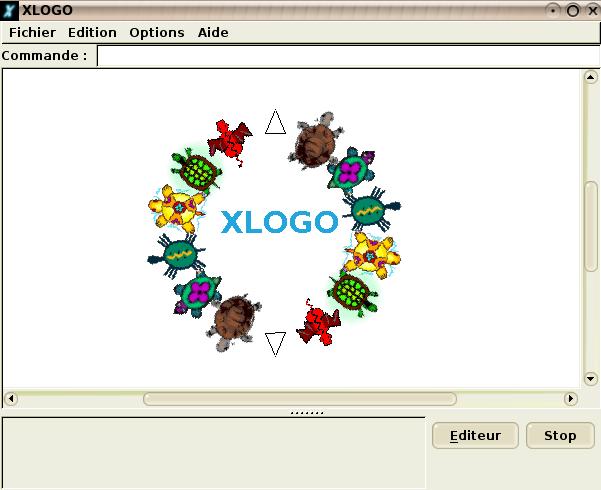
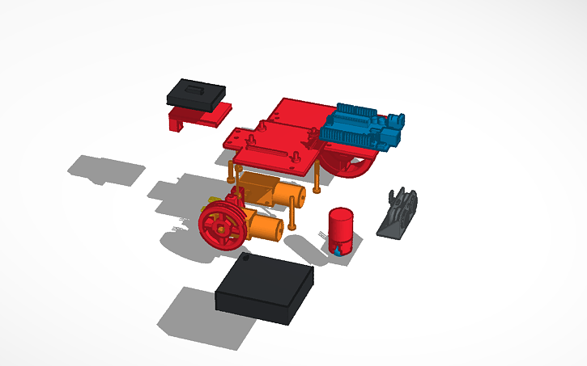
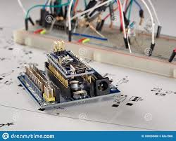

# :bookmark_tabs: Fiche d'accompnement 1
> ## :clipboard: Déscription du projet
le projet consite à créer un **Arduino drawing robot** qui va déssiner un drapeau de votre choix.

> ## :beginner:Phase 1
à l'aide de Xlogo vous allez réaliser un programme qui déssine un drapeau

> ## :dart: phase 2
La conception du robot à l'aide d'un simulateur ex : Tinkercad

> ## 🚀: phase 3
Fabrication du robot en utilisant les composants adéquats

